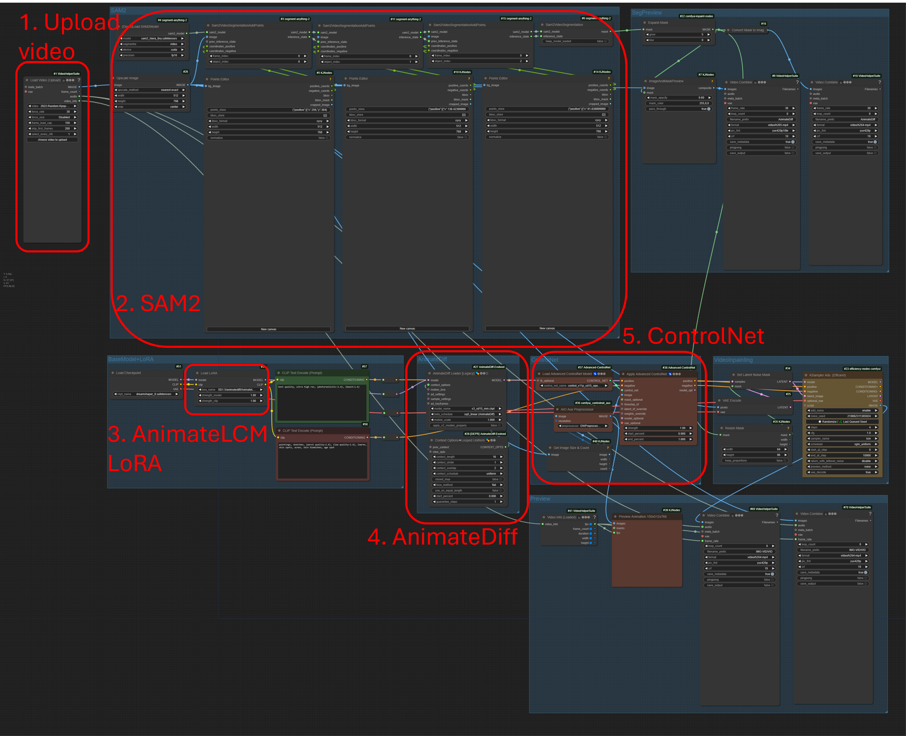

# ComfyUI-workflow
Various personal developed workflows for ComfyUI

## VideoEditting
SAM2 + Stable Diffusion + AnimateDiff + LoRA + ControlNet

### Workflow usage

1. Upload video.
2. Run the workflow until the first frame from the video is in the SAM2 point editors, then cancel running (or you can leave it).
3. Add positive or negative points (shift + left click for positive; shift + right click for negative).
4. Run again.

# Video Reference
https://www.youtube.com/shorts/Ay21VqHE90g
